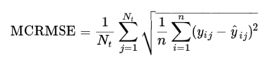

# FeedbackPrize3

[link](https://www.kaggle.com/competitions/feedback-prize-english-language-learning/overview/description)

## Task
8~12年生の英語学習者(ELL)の言語能力を評価する。ELLによって書かれたエッセイのデータセットを利用。エッセイは cohesion, syntax, vocabulary, phraseology, grammar, conventions の6つの尺度によって採点される。

 

### 評価関数

## Models
- deberta-v3-base

- deberta-v3-large

- deberta-xlarge

- deberta-v2-xlarge

## Main methods that worked
- Resolve encoding error
- add BERTopic text
- MultilabelStratifiedGroupKFold
- Pooler Output
  - Last Hedden State Output
    -  Mean Pooling
  - Hidden Layeers Output
    - CLS Layer Embeddings
    - Attention Pooling
- Layer Reinitialization
- Mixout Regularization
  - [paper](https://arxiv.org/abs/1909.11299)
- Multi-sample dropout
  - [paper](https://arxiv.org/abs/1905.09788)
- Grouped-LLRD (Layer Wise Learning Rate Decay)
- Pre-trained Weight Decay
- Adversarial training (FGM)
  - [paper](https://arxiv.org/pdf/1710.06081.pdf)
- SmoothL1Loss
- polynomial learning rate scheduler
- Pseudo labeling([reference](https://www.kaggle.com/competitions/feedback-prize-effectiveness/discussion/347359))

  1. Train model with fb3 train labels
  2. Make predictions for fb1 data (10000 essays) with each fold model
  3. Retrain model with crossentropy on pseudo label probabilities (not discretized) generated by previous model trained on the same fold data: 3 epochs on fb1 pl labels only first and then 3 more epochs on fb3 train labels only
  4. Repeat from step ii

 
 

| exp | model | cv |
---- | ---- | ---- 
| 22 | deberta-v2-xlarge | 0.4510 |
| 29 | deberta-xlarge | 0.4508 |
| 36 | deberta-v3-large | 0.4504 |
| 38 | deberta-v3-large | 0.4502 |
| 40 | deberta-v3-base | 0.4519 |
| 41 | deberta-v3-base | 0.4517 |
| 42 | deberta-v3-base | 0.4510 |

 

## Final Result
158 / 2655  位  🥉

CV : 0.445740

Public LB : 0.438067

Private LB : 0.436347
